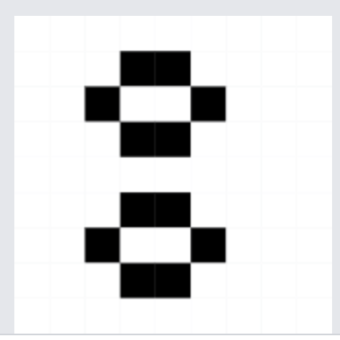

This is **Next.js** application with built-in gpt-3.5-turbo and the ability to generate game of life images.

Things I want to note:
1. An application based on **Next.js** framework.
2. Was decided to choose a common **openai** library because of the clear documentation and simple error handling.
3. The application uses the **SSE** transport to render the output stream of the model as it is generated. Attention was paid to handling cases such as an empty invitation, an authorized request, an invalid API key, etc. Also, error messages are displayed in the client as messages from OpenAI.
4. Social login implemented using **next-auth**, and Google was selected for OAuth.
5. The application stores messages history in the local storage.
6. If OpenAI responds with a 0&1 matrix inside the ``` block and with the number then (number of iterations), the application will start the game of life using the provided matrix and iterations number, and sends the result back. The application will display the result on canvas.

### Prompt Example to see game of life

#### Prompt:
<pre>
We are about to start playing Game of Life. Please generate random starting state and then iteration number.

The format is starting state must be 0 and 1 matrix in markdown code block, where 0 means dead cell and 1 represents life cell.
Matrix should have any number of columns between 20 and 100 and any number of rows between 20 and 100. Then comes single number number of iteration to generate between 1 and 100000.

Don't use natural language.
</pre>

#### Response:
<pre>
Starting State:
```
011011011
100100100
011011011
100100100
011011011
100100100
011011011
100100100
011011011
```

Number of Iterations: 500</pre>


